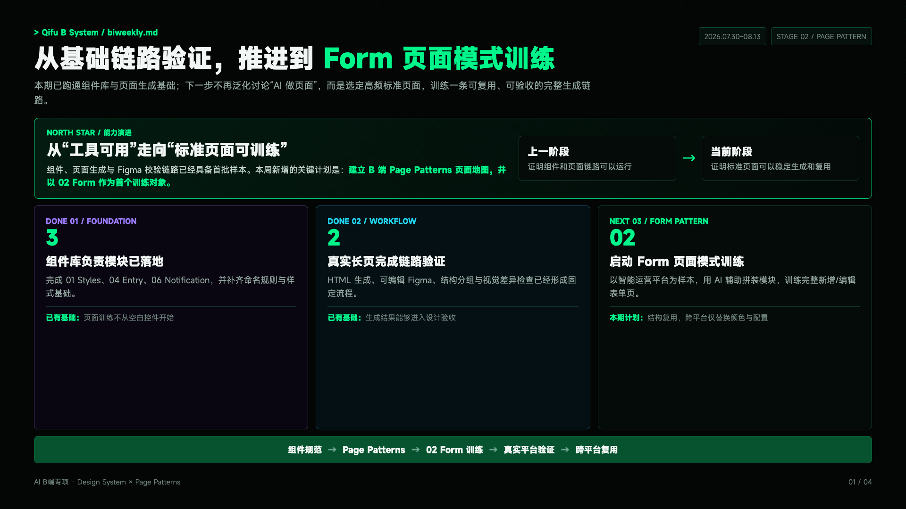
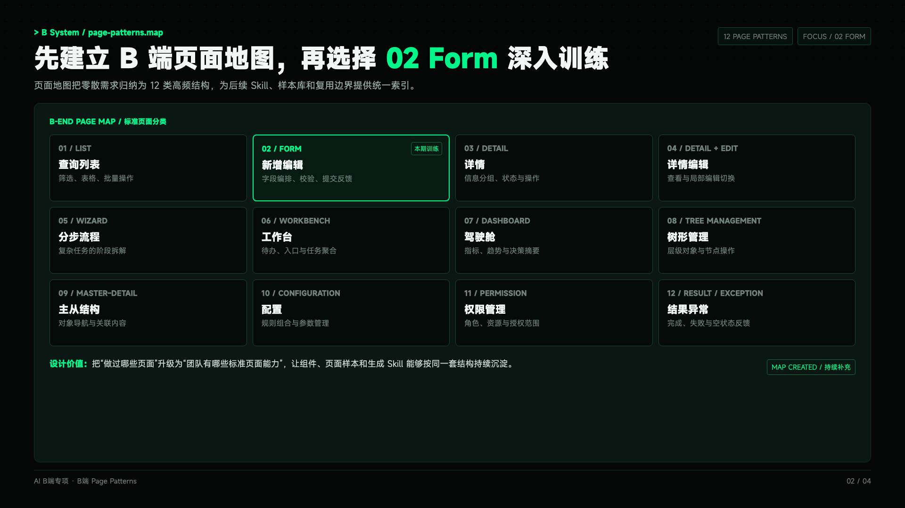
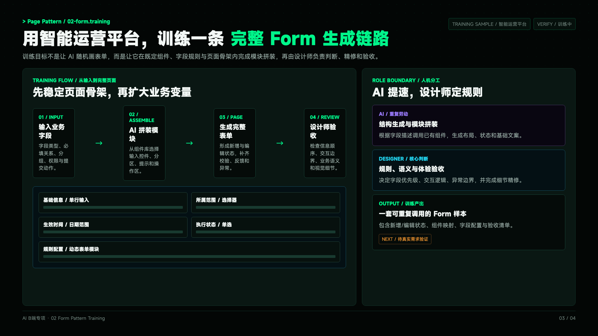
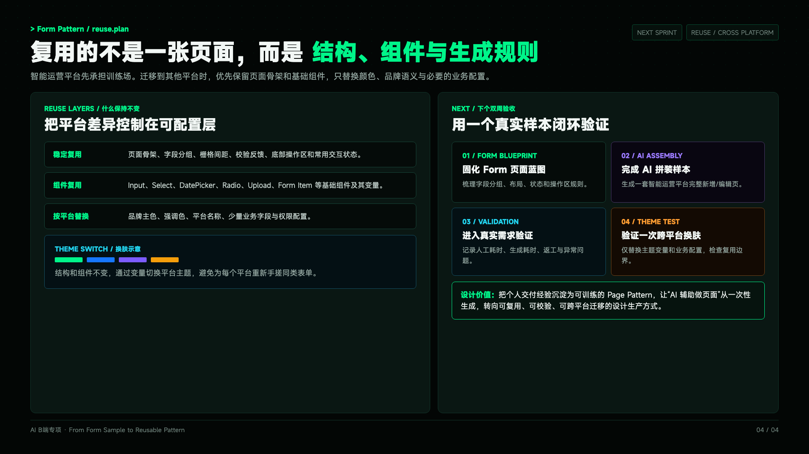

# AI 双周会汇报 Skill

把 AI 项目计划、进展、交付证据、问题取舍和下一步计划，整理为适合设计团队双周会展示的深色科技风汇报。

它面向设计团队的 AI 实践：不把「使用了工具」当作成果，而是把每个动作落到可检查的交付物、证据和下一步验证上。

## 能生成什么

- 固定 `1920 × 1080` 的 HTML 汇报页，或匹配标准样例的 `1920px` 宽连续长卷。
- 黑底、荧光绿为主线的工程控制台视觉：状态标签、能力路径、阶段时间轴、证据卡与风险提示。
- 清晰区分年度目标、已完成、验证中、受阻和下一步，避免把计划写成已完成事实。
- 适合导入 Figma 的语义化内容块标记，便于继续编辑。
- 可按「本期判断 / 做了什么 / 验证反馈」压缩为 3 页汇报版本。
- 可根据参考画板生成更有表现力的 Figma 版本，同时保持 Auto Layout、间距和语义层级可编辑。
- 可从结构化 JSON 稳定渲染，并自动检查页码、模板变量、内容块标识、实际指标来源和明显字号问题。

## 适用场景

- AI 设计系统、组件库、页面模式或工作流建设的双周同步。
- 多个项目、Skill、Agent、自动化实验的进度归纳。
- 需要向团队说明「本期变化—证据—缺口—下一步」的阶段性汇报。

## 使用方式

将本目录放入 Codex Skills 目录后，在对话中使用：

```text
使用 $ai-biweekly-report，将以下计划、本期进展和交付证据整理成双周会汇报。
```

准备材料时，建议提供：周期、一句话结论、北极星目标、本期动作与交付物、可验证证据、问题与取舍、下一步动作及待采集数据。详见 [内容映射](references/content-mapping.md)。

仓库内包含经过审查的 [视觉样例规则](references/sample-standard.md)。其他团队视觉稿和内部 B 端历史汇报只用于提炼规则，不随公开仓库分发；它们不会决定新报告的事实，也不会把原样例中的品牌资产或数据带入输出。

用户本人历史 B 端汇报另行沉淀为 [B 端内容标准](references/b-end-content-standard.md)，它负责问题推演和验证闭环，优先级高于其他团队的视觉样例。

也可以直接使用结构化渲染器：

```bash
node scripts/render-report.mjs examples/sample-report.json report.html
node scripts/validate-report.mjs report.html
```

运行完整 smoke test：

```bash
node scripts/test-skill.mjs
```

## 历史视觉样例

以下图片用于保留原始视觉方向，生成时间早于当前渲染器与页码校验，不作为现版本的自动化验收基准。现版本的可执行基准是 [sample-report.json](examples/sample-report.json) 与 `node scripts/test-skill.mjs`。









## 目录说明

```text
├── SKILL.md                     # 主流程与交付检查清单
├── agents/openai.yaml            # Skill 元数据
├── assets/template.html          # 1920 × 1080 HTML 模板
├── scripts/render-report.mjs      # JSON → HTML 渲染器
├── scripts/validate-report.mjs    # HTML 静态校验
├── scripts/test-skill.mjs         # Skill 与样例 smoke test
├── examples/sample-report.json    # 普通双周汇报输入样例
├── examples/sample-b-end-report.json # B 端验证闭环输入样例
├── references/input-contract.md   # 结构化输入、证据和决策字段
├── references/content-mapping.md # 内容结构、状态词典与数据纪律
├── references/style-system.md    # 视觉系统与排版规则
├── references/sample-standard.md # 其他团队视觉样例的审查结论与版式原型
├── references/b-end-content-standard.md # 用户历史 B 端内容逻辑与验证闭环
├── references/review-checklist.md # 架构/设计/产品/研发/测试五角色审查
├── references/html-output.md      # HTML 生成与导出规则
├── references/figma-output.md     # Figma 结构与节点 QA
├── references/testing.md          # 测试矩阵与验收规则
└── examples/screenshots/         # 真实生成样例
```

## 设计原则

1. 先明确目标与本期变化，再展示交付证据。
2. 每项进展按「动作 → 产出 → 证据 → 意义」表达。
3. 没有基线时不编造效率数据；计划数字必须明确标为目标值。
4. AI 负责结构化生成，设计师负责判断、取舍、精修与验收。
5. 不同语义层级分开呈现：观众要反馈的内容用主卡片，团队后续处理动作用流程条或低权重说明带。
6. Figma 能力不可用时，保留并交付已经完成的内容和 HTML。

## License

供个人或团队内部的 AI 设计汇报工作流复用；如需对外分发，请先确认其中示例内容与品牌素材的使用范围。
